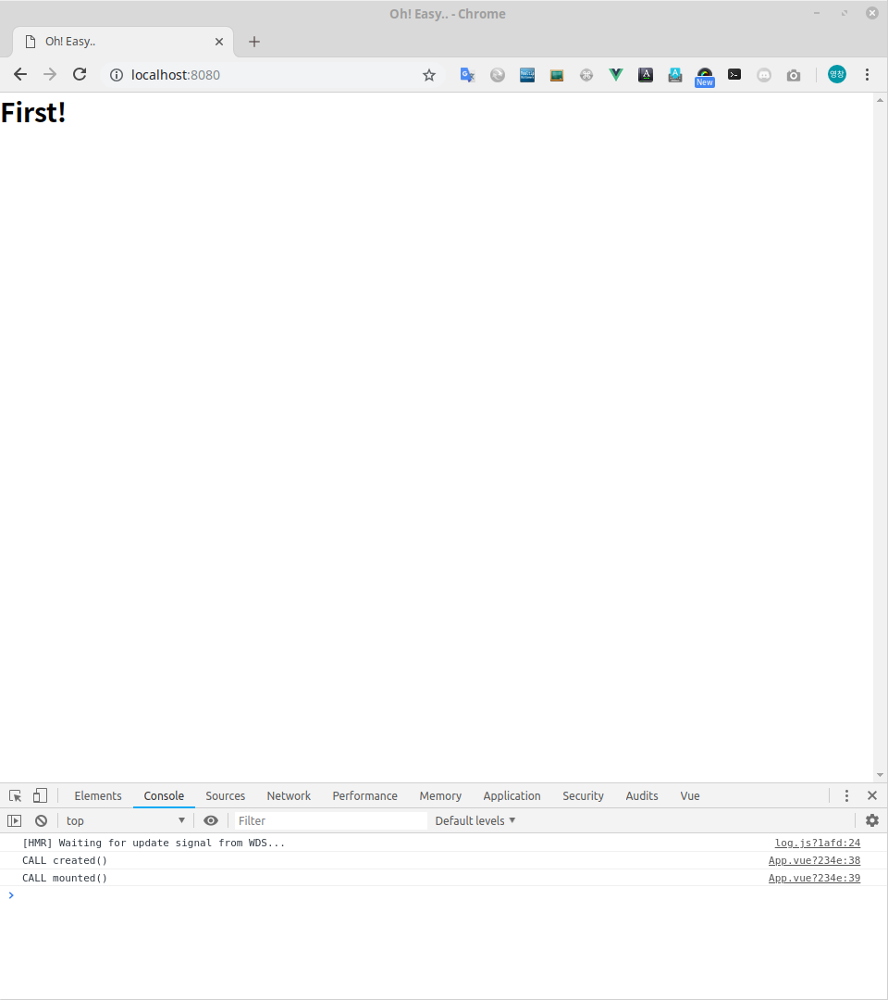

# 간단한 소스로 만들기

Vue로 개발하려는 초보자들을 위한 가이드 문서입니다.  
이 장은 VUE-CLI 3.0을 이용하여 구축 한 소스를 추후 진행을 위해 소스를 간단하게 정리하는 방법을 알려 드립니다. 

> 유영창 : frog@falinux.com

## 페이지 이동

* [전체 목차](../README.md) 
* [이전 단계](./A002-Vue-프로그램-기본-구축.md)
* [다음 단계](./A004-초-간단-채팅-서비스.md)

## 간단한 소스로 만들기

여러분은 아마도 생성된 소스가 어떻게 동작하는지 알고도 싶고 뭔가 하고 싶을 것입니다. 
참으십시오!

일단 필요 없는 것들을 제거 하고, 현업에 사용할 만한 기본적인 구조를 만들 겁니다. 

이 과정 역시 따라하시면 바로 끝납니다. 

### 준비

소스 청소를 하려면 세가지 준비가 필요합니다. 

1. 개발 서버 실행
2. 브라우저 실행
3. 소스 편집기 실행

개발 서버는 다음 명령으로 실행하시면 됩니다.

~~~ bash
$ cd ~/start-study/docker
$ ./run-dev.sh 
~~~

브라우저 접속은 다음 URL 을 입력 합니다. 

> localhost:80080/

브라우저에서 페이지가 보이시면 반.드.시 ! F12 키를 눌러 개발 툴을 활성화 시키셔서 꼭 Console 에 어떤 내용이 보이는지 에러가 없는지 확인 하십시오.
현재까지 따라하기를 하셨다면 뻘건 색으로 webSocket connection to 어쩌구 하는 것이 표시 될텐데 일단 무시 하십시오

그리고 이제 에디터를 실행하여 편집 준비를 마쳐 주시기 바랍니다. 

### 리눅스 명령을 위한 터미널 창 셋팅 팁!

리눅스 환경에서 프런트엔드를 개발하시면 명령창을 띄우게 되는게 대부분의 경우 터미널 에뮬레이터의 경우 탭 기능을 제공합니다. 
저는 터미널 에뮬레이터 창을 띄운 후 보통 5개의 탭을 띄우고 각 탭 마다 목적성을 둡니다. 
그리고 핫키를 이용하여 탭을 빠르게 오고 가며 개발 합니다. 

다음은 제가 보통 사용하는 각 탭의 목적입니다. 

* 탭1 : 백엔드 개발 에뮬레이터 서버 실행 
* 탭2 : 백엔드 개발 에뮬레이터 서버 명령창으로 이용
* 탭3 : 프런트앤드 개발 서버 실행
* 탭4 : 프런트앤드 개발 명령창으로 이용
* 탭5 : 기타 일반 리눅스 명령창으로 이용

위 사용은 제 취향인데 여러분도 사용하시면 빠른 개발 진행에 크게 도움이 되실 겁니다. 

### VUE 프레임 워크 흐름과 소스

여러분이 처음 소스를 살펴 볼 때 다음 순서대로 소스를 살펴 보면 좋습니다. 
이 순서는 components 를 제외 하면 VUE 의 동작 순서이기도 합니다. 

1. public/index.html
2. src/main.js
3. src/App.vue
4. src/router.js
5. src/view/
6. src/components/

7. tests/unit/
8. tests/e2e/

청소도 이 순서대로 합니다. 

### public/index.html 청소

index.html은 솔찍히 청소 대상은 아닙니다. 단지 브라우저의 탭에 나올 내용을 수정하는 겁니다. 

브러우저 탭에 나오는 타이틀은 <title> 태크로 설정된 내용이 나옵니다. 
그래서 다음과 같이 이 태크를 "Oh! Easy.." 로 수정하겠습니다. 

보통 이 타이틀은 웹을 구별하기 위한 것입니다.
물론 프로그램 실행 단계에서 자바 스크립트로 수정도 가능합니다.

> [public/index.html](https://github.com/kcert2018/start-vue-build-up-guide/blob/master/apps/z020-home-main-clean/public/index.html)
~~~
<!DOCTYPE html>
<html lang="en">
  <head>
      :
    <title>Oh! Easy..</title>
~~~

에디터에서 수정하고 저장하면 내용이 바뀐것을 확인 하실 수 있을 겁니다. 

그리고 index.html 을 보면 다음과 같은 문구가 있습니다 .

~~~
<!-- built files will be auto injected -->
~~~

이 주석은 VUE 컴파일러가 이 부분에 자동으로 소스들을 추가 한다는 의미 입니다.
즉 이 부분 이하는 건들지 않고 위 문구도 제거하시지 마세요.

VUE 개발시에 index.html 은 특별한 경우가 아니면 건들지 않게 됩니다. 

### src/main.js 청소

main.js 는 VUE 가 시작되는 곳입니다. 

청소 대상은 graphql apollo 관련 부분입니다. 
따라하기 단계상 아직은 서버와 연결될 필요가 없습니다.
GraphQL 서버 연결 처리 부분을 주석 처리합니다.

다음과 같이 import { createProvider } from './vue-apollo' 와 apolloProvider: createProvider(), 을 주석 처리 합니다. 

> [src/main.js](https://github.com/kcert2018/start-vue-build-up-guide/blob/master/apps/z020-home-main-clean/src/main.js)
~~~
import store from './store'
// import { createProvider } from './vue-apollo'
    :
new Vue({
    :
  // apolloProvider: createProvider(),
    :
}).$mount('#app')
~~~

수정한 결과로 브라우저 개발 툴 Console 창에 뻘건 색으로 webSocket connection to 어쩌구 하는 것이 표시되지 않은 것을 확인 할 수 있습니다. 

### src/App.vue 청소

App.vue은 웹 페이지가 가장 처음 표시되는 내용을 다룹니다. 

보통은 전체 화면 레이아웃을 여기서 정의합니다. 
초보분들은 레이아웃을 어떻게 정의 하는지는 아직 크게 신경 쓸 필요도 없습니다.
청소 단계에서는 초보분들이 자주 참조할 형태의 참고 소스를 만들 겁니다. 

묻지도 따지지도 말고 다음과 같이 App.vue 를 만드세요

> [src/App.vue](https://github.com/kcert2018/start-vue-build-up-guide/blob/master/apps/z020-home-main-clean/src/App.vue)
~~~
<template>
  

    <h1>First!</h1>
  

</template>
import { mapGetters, mapMutations, mapActions } from 'vuex'

export default {
  name: 'App',

  data () {
    return {
    }
  },

  computed: {
    ...mapGetters({
    }),

    sample: {
      get () { return '' },
      set (newValue) {}
    }
  },

  components: {
  },

  methods: {
    ...mapMutations({
    }),
    ...mapActions({
    })
  },

  created () { console.log('CALL created()') },
  mounted () { console.log('CALL mounted()') },
  activated () { console.log('CALL activated()') },
  deactivated () { console.log('CALL deactivated()') },
  destroyed () { console.log('CALL destroyed()') }
}

~~~

이 소스의 많은 부분은 프로그램 동작에 영향을 미치지 않습니다. 
그런데 왜 위 소스처럼 만들었냐구요? 여러분은 초보자이기 때문입니다. 

VUE 를 어떻게 작성해야 하는지에 대한 자신만의 가이드 라인도 없고 문법도 익숙하지 않습니다.
어떤게 맞는지 확신하시지도 못하죠..
그래서 친절한 제가 저만의 노우 하우 (?) 를 여러분에게 알려 드리는 겁니다. 

크게 성능에 영향을 미치지 않으므로, 인터넷 뒤지시는 것보다 이렇게 참고용 소스를 App.vue 로 만들어 놓는게 좋습니다. 
앞으로 vuex 처리나 view/ 디렉토리에 만들 뷰 컴포넌트들의 라이프 사이클 관리를 하시게 되면 다 필요한 함수 들입니다. 

그냥 일단 믿고 따라와 주시기 바랍니다. 

### src/router.js 청소

router.js 는 각 웹 뷰 페이지들을 분리하고 관리하는데 중심이 되는 소스입니다. 
따라하기 이후에 주기적으로 수정하므로 여기서는 이런게 있다고만 생각하시기 바랍니다. 

청소의 핵심은 비우는 거죠! 

다음과 같이 확! 비워 버립니다.

> [src/router.js](https://github.com/kcert2018/start-vue-build-up-guide/blob/master/apps/z020-home-main-clean/src/router.js)
~~~
import Vue from 'vue'
import Router from 'vue-router'

Vue.use(Router)

export default new Router({
  // mode: 'history',
  base: process.env.BASE_URL,
  routes: [
  ]
})
~~~

주석 처리하고 있는 "mode: 'history'," 는 여러분의 취향에 달렸습니다.

마이크로 서비스 개발 방식으로 각 기능별로 별도의 앱을 만들 경우,
위와 같이 주석 처리 하시면 각 앱의 특정 뷰에 접근하실 때 URL에 해쉬태그를 이용할 수 있습니다.

쿠버네티스나 웹 페이지 제공 서버로 아파치나 NGINX 를 사용하실 계획이면,
위와 같이 주석 처리 하여 히스트로 모드를 사용하지 않는 것이 좋습니다. 

앞으로 진행하면서 배포 단계에서 설명이 될 것이므로 지금은 뭥미? 하셔도 괜찮습니다. 무시하세요  ^^;

### src/view/ 청소

src/view/ 디렉토리는 실제 UI 를 만들고 관리하는 뷰 소스를 모아 놓는 곳입니다. 

현재는 청소 중이므로 이 안에 있는 파일들을 모두 제거 합니다. 

### src/components/ 청소

src/components/ 디렉토리는 UI가 공통적으로 쓰고 어플리케이션 의존적이지 않은 공통 컴포넌트를 모아 놓는 곳입니다. 

현재는 청소 중이므로 이 안에 있는 파일들을 모두 제거 합니다. 

### tests/unit/ 청소

소스를 변경했으므로 관련된 단위 테스트도 청소해 줄 필요가 있습니다. 
심플하게 다음 파일을 제거하세요

> tests/unit/example.spec.js

### tests/e2e/ 청소

e2e 는 최소한 하나의 테스트 파일이 있어야 합니다. 기존에 있던 tests/e2e/specs/test.js 파일을 다음과 같이 수정해 주세요

> [tests/e2e/specs/test.js](https://github.com/kcert2018/start-vue-build-up-guide/blob/master/apps/z020-home-main-clean/tests/e2e/specs/test.js)
~~~
// https://docs.cypress.io/api/introduction/api.html

describe('Sample Test', () => {
  it('Nothing...', () => {
  })
})
~~~

### 따라하기 실행 화면 

자 청소가 끝났습니다. 즐거운 마음으로 청소 결과를 보시죠..

실행 결과는 다음과 같이 나옵니다. 

### 항상 습관처럼 실행 하자!

이제 최종적으로 여러분이 따라하기에 문제가 없는지 다음 스크립트를 수행해서 확인합니다. 
이 과정은 조금 귀찮더라도 조기 퇴근을 위해서 꼭 습관화 하세요!

~~~
$ ./run-lint.sh
$ ./run-unit.sh
$ ./run-e2e.sh 
~~~

## 페이지 이동

* [전체 목차](../README.md) 
* [이전 단계](./A002-Vue-프로그램-기본-구축.md)
* [다음 단계](./A004-초-간단-채팅-서비스.md)
