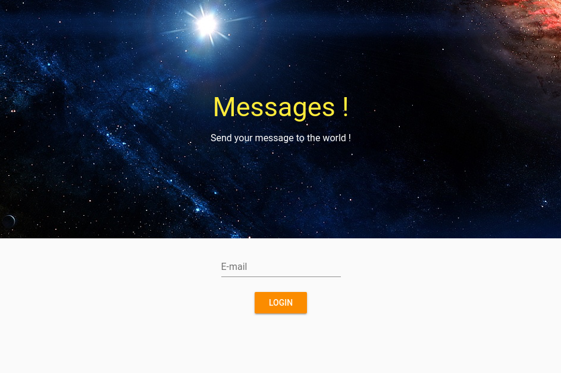
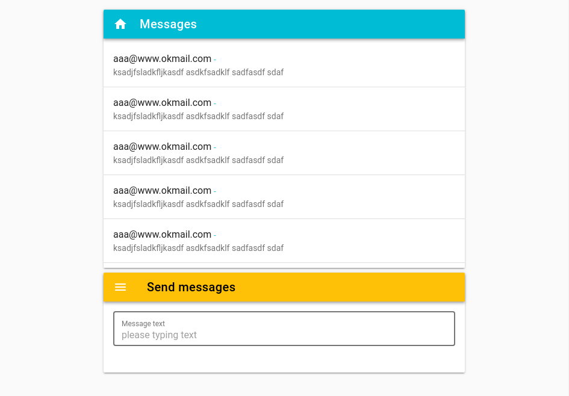

# 초 간단 채팅 서비스

Vue로 개발하려는 초보자들을 위한 가이드 문서입니다.  
이 장은 따라하기를 위한 초 간단 채팅 서비스를 설계합니다. 

> 유영창 : frog@falinux.com

## 페이지 이동

* [전체 목차](../README.md) 
* [이전 단계](./A003-간단한-소스로-만들기.md)
* [다음 단계](./A005-라우팅.md)

## 초 간단 채팅 서비스

따라하기를 위해서 우리는 만들어갈 서비스를 구상해야 합니다.
이왕이면 학습에 필요한 요소를 골고루 가지고 있으면서도 쉬운게 좋겠죠?

그래서 초 간단 채팅 서비스를 만들기로 했습니다. 

다음과 같은 시나리오를 갖는 것으로 하겠습니다. 

1. 사용자는 채팅 서비스를 제공하는 사이트인지를 홈페이지에 접속하여 알게 됩니다. 
2. 사용자는 자신의 메일 주소로 로그인 합니다. 너무 개방적인 사이트라 암호도 필요 없고 가입도 필요 없습니다. 
3. 사용자가 로그인 하면 바로 채팅 메세지 창이 뜹니다. 위 아 더 월드라 누구나 떠들 수 있습니다. 
4. 사용자는 텍스트로 메세지 글을 입력 하면 사이트에 접속하면 누구나 지금까지 한 화면 분량의 마지막 메세지를 볼 수 있습니다. 

끝~~~

진짜 간단하죠?

자 이걸 만들어 가 봅시다.

### 필요한 웹 페이지 정의

위 시나리오 대로 한다면 페이지는 두 페이지면 됩니다. 

* 홈페이지 겸 로그인 페이지 
* 메세지 처리 페이지 

이렇게 만들 겁니다. 

> 홈페이지 겸 로그인 페이지

> 메세지 처리 페이지 

## 페이지 이동

* [전체 목차](../README.md) 
* [이전 단계](./A003-간단한-소스로-만들기.md)
* [다음 단계](./A005-라우팅.md)
