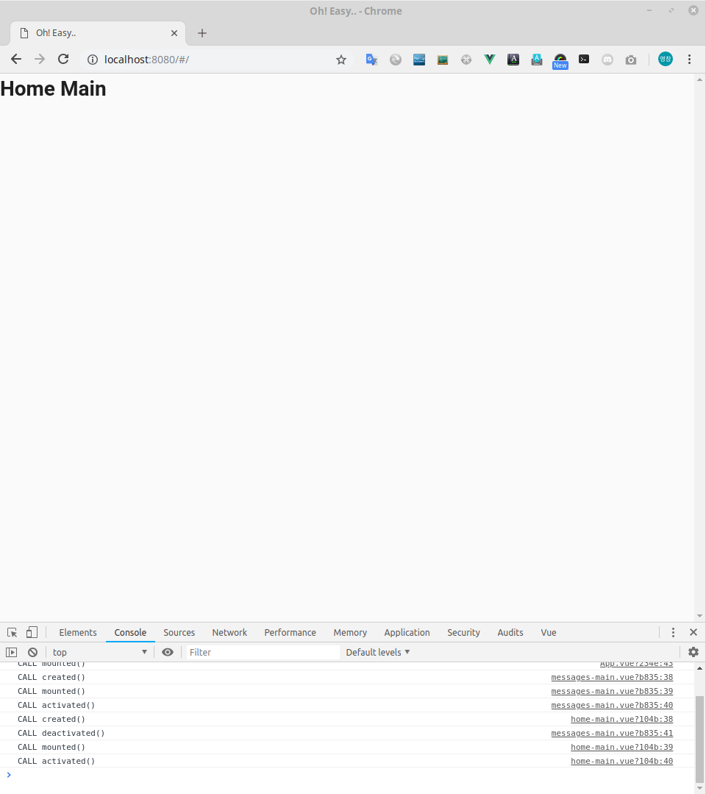
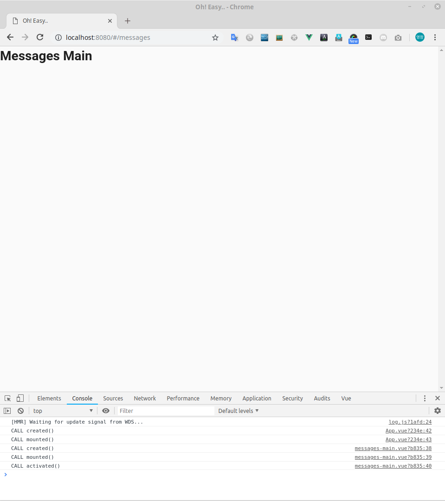

# 라우팅

Vue로 개발하려는 초보자들을 위한 가이드 문서입니다.  
이 장은 라우팅 처리를 설명합니다. 

> 유영창 : frog@falinux.com

## 페이지 이동

* [전체 목차](../README.md) 
* [이전 단계](./A004-초-간단-채팅-서비스.md)
* [다음 단계](./A000-준비중.md)

## 라우팅

시나리오가 준비 되었고 필요한 화면이 결정되었으므로 이를 VUE 로 구현하기 위해서 가장 먼저 라우팅 처리를 하겠습니다. 

라우팅 처리는 router.js 을 수정하고 화면별 뷰 컴포넌트를 src/view/ 디렉토리에 소스 형태로 만듭니다.

일단 기본적인 정보를 정의 할 필요가 있습니다. 

우리가 만들 화면은 다음 두 가지 입니다. 

* 홈페이지 겸 로그인 페이지 
* 메세지 처리 페이지 

이름과 파일명을 다음과 같이 정합니다. 

* 홈페이지 겸 로그인 페이지 

    - 파일명 : views/home-main.vue  
    - 컴포넌트 이름 : home-main  
    - URL : /  
    - 해쉬 URL : /#/  

* 메세지 처리 페이지 

    - 파일명 : views/messages-main.vue  
    - 컴포넌트 이름 : messages-main  
    - URL : /messages
    - 해쉬 URL : /#/messages  

컴포넌트나 파일명은 저 개인 적인 취양입니다.  

전 디렉토리 깊이가 너무 깊어 지는 것을 싫어 합니다. 
나중에 프로그램 수정이나 버그 잡을 때 가급적 쉽게 찾을 수 있는 구성과 이름을 짓도록 합니다. 

그래서 폴더형태로 각각을 구별해 나가기 보다는 파일명을 조금 구조적으로 이름을 지어서 작업합니다. 
보통 앞에는 가장 큰 구룹을 구분짓는 이름을 쓰고 '-' 로 붙인 후 세부 구별이름을 씁니다. 새부 구별명은 1 개 이상을 쓸 수 도 있습니다. 

그리고 큰 구룹의 세부 구별명으로 사용하는 main 은 각 구룹별 시작점이면서 핵심에 해당하는 것을 의미합니다.

views/ 디렉토리에 생성되는 뷰 컴포넌트는 나중에 vuex 유닛과 연결되고 어플리케이션 데이터에 의존적인 컴포넌트로 작성합니다. 

반면에 components/ 디렉토리에 생성되는 컴포넌트는 일종에 라이브러리 같은 것으로 어플리케이션에 종속되지 않는 형태로 작성합니다.

### home-main.vue 생성

이제 사이트에 처음 방문했을 때 처리될 home-main.vue 를 다음과 같이 작성합니다. 
앞의 따라하기에서 작성했던 App.vue 를 조금 바꾸어서 다음과 같이 작성합니다. 

> [src/views/home-main.vue](https://github.com/kcert2018/start-vue-build-up-guide/blob/master/apps/z030-home-main-router/src/views/home-main.vue)
~~~ javascript
<template>
  

    <h1>Home Main</h1>
  

</template>

~~~

여러분이 주의해서 보셔야 할 것이 있습니다. 

"home-main" 이 사용된 곳 입니다. 

첫번째는 `<template>` 의 가장 상위에 선언된 `
` 입니다. 
두번째는 `

~~~

여기까지 진행했다고 해서 홈페이지가 특별히 변하지는 않습니다. 어플리케이션에 이 두 소스가 포함되지 않았기 때문입니다. 

이제 위 두 페이지를 어플리케이션과 연결하고 컴파일 대상에 포함시키기 위해서 router.js 와 App.vue 를 수정해야 합니다. 

### router.js 수정

home-main.vue 는 "/" 에 연결 할 겁니다. 
messages-main 는 "/messages/ 에 연결 할 겁니다. 

브라우저 접근은 해쉬 형태로 접근합니다.

home-main.vue 는 "/#/" 이 됩니다. 
messages-main 는 "/#/messages/ 이 됩니다. 

만들어진 두 뷰 페이지를 router.js 를 사용하여 연결해야 합니다. 

생각보다 간단합니다. 다음과 같이 수정하면 됩니다. 

> [src/router.js](https://github.com/kcert2018/start-vue-build-up-guide/blob/master/apps/z030-home-main-router/src/router.js)
~~~ javascript
import Vue from 'vue'
import Router from 'vue-router'

Vue.use(Router)

export default new Router({
  // mode: 'history',
  base: process.env.BASE_URL,
  routes: [
    {
      path: '/',
      name: 'home-main',
      component: () => import('./views/home-main.vue')
    },
    {
      path: '/messages/',
      name: 'messages-main',
      component: () => import(/* webpackChunkName: "messages-main" */ './views/messages-main.vue')
    },
    {
      path: '*',
      redirect: '/'
    }
  ]
})
~~~

위 소스에 보듯이 크게 세개의 라우팅을 정의 합니다. 

두개는 home-main 과 messages-main 뷰에 대한 라우팅을 정의합니다.
마지막 한개는 선언되지 않는 url 접근에 대한 처리 라우팅을 정의 합니다. 

이 세개는 각각 특징을 가지고 있습니다. 

우선 마지막 것 부터 이야기 하겠습니다. 

~~~ javascript
{
    path: '*',
    redirect: '/'
}
~~~

이 부분은 path 가 '*' 로 선언되어 있습니다. 
이것은 모든 url 에 대한 처리를 한다는 의미입니다. 

그래서 앞에서 순차적으로 선언된 것을 url 과 비교해서 매칭이 되지 않은 모든 것은 이 라우팅 선언이 처리 합니다. 

이렇게 정의 되지 않은 url 의 접근에 대한 처리는 크게 두가지로 작성들 합니다. 
하나는 제가 즐겨 하는 방식인 디폴트 메인 페이지로 되 돌리는 것입니다. 그래서 리다이렉션 처리를 한 것입니다. 
또 하나는 페이지 없음을 나타내는 페이지를 만들고 그쪽으로 이동 시키는 겁니다. 

뭐 여러분은 편한대로 하십시오.. 어떻게 하든 상관이 없습니다. 

이제 우리가 처리할 페이지의 라우팅을 정의 한 두 개 중 첫번째를 살펴 봅시다.

~~~ javascript
{
    path: '/',
    name: 'home-main',
    component: () => import('./views/home-main.vue')
},
~~~

여기에서 접근 URL 패스는 "/" 입니다. 보통 홈페이지에 할당되는 것이죠. 예를 들어 브라우저에서는 "http://www.sample.com/" 라고 접근합니다. 
아니면 해쉬 가 적용되므로 "http://www.sample.com/#/" 라고 접근해도 됩니다. 

이때 라우트 이름은 "home-main" 입니다. 뷰 컴포넌트 이름과 같은 것을 쓰고 있습니다. 이건 제 프로그램 룰입니다. 여러분의 룰을 따로 가지고 있다면 
굳이 이렇게 쓰지 않고 라우팅을 구별할 이름을 부여 하면 됩니다. 하지만 초보자시라면 제 룰을 따르시는 것이 수명 연장에 도움이 될 겁니다. 

마지막으로 component: () => import('./views/home-main.vue') 는 해당 라우팅 URL 에 접근했을 때 처리되는 뷰 컴포넌트 소스를 지정하는 것입니다. 

이제 메세지를 처리 하는 페이지 라우팅을 살펴 보죠

~~~ javascript
{
    path: '/messages/',
    name: 'messages-main',
    component: () => import(/* webpackChunkName: "messages-main" */ './views/messages-main.vue')
},
~~~

앞에 선언된 것과 다른 점이라면 /* webpackChunkName: "messages-main" */ 가 삽입된 것입니다. 
이 부분이 선언됨으로써 messages-main 뷰 컴포넌트는 처음 웹 페이지에 접근할 때 로드 되지 않고 
실제 라우팅이 발생하여 필요할 때 로드 되도록 컴파일 된다는 의미 입니다. 

빠른 초기 로딩을 위한 늦은(Lazy) 로딩 기법입니다. 참 편하죠?

### App.vue 수정

앞에서 라우팅을 선언했지만 실제로 페이지에 반영이 되지 않습니다. 왜냐하면 라우팅된 뷰 컴포넌트를 그려줄 부분을 정의하지 않았기 때문입니다. 

라우팅 된 뷰를 포함하도록 하는 VUE 컴포넌트 태크는 `<router-view/>` 입니다. 

이제 각 뷰 페이지가 포함되도록 App.vue 의 `<template>`를 수정합니다.

> [src/App.vue](https://github.com/kcert2018/start-vue-build-up-guide/blob/master/apps/z030-home-main-router/src/App.vue)
~~~ html
<template>
  <v-app id="app">
    <v-content>
      <keep-alive include="" >
        <router-view/>
      </keep-alive>
    </v-content>
  </v-app>
</template>
~~~

여기서 v-app, v-content 는 Vuetify 에서 제공하는 태크입니다. 이 부분은 그려려니 넘어가 주십시오.
이거 대신 `
` 를 사용해도 상관은 없습니다. 

라우팅 뷰를 보여주는 핵심은 다음입니다.

~~~
<keep-alive include="" >
    <router-view/>
</keep-alive>
~~~

라우팅 된 뷰 컴포넌트는 `<router-view/>` 에 그려지게 됩니다. 이게 핵심입니다. 

그러면 keep-alive 는 무얼까요? 

뷰에서 컴포넌트는 해당 페이지에서 벗어나면 없어 집니다. 보통때는 큰 문제가 없는데 편집기 같은 내용이 다른 페이지로 이동하더라도 보존되어야 할때가 있습니다. 
이때 페이지가 이동되더라도 해당 페이지 뷰가 제거 되지 않고 유지 될 내용을 include="" 에 포함 시키면 됩니다.

초보자분들은 여기까지만 이해하시면 됩니다.

저의 오지랍으로 여러분이 언젠가는 사용하는 것 중 하나라서 코드에 미리 넣어 둔 겁니다. 

### 따라하기 실행 화면 

자 이제 라우팅 처리가 끝났습니다. 즐거운 마음으로 결과를 보시죠..

브라우저에서 각각 다음과 같이 URL 을 입력해 보세요

* http://localhost:8080/#/
* http://localhost:8080/#/messages

> http://localhost:8080/#/  
  

> http://localhost:8080/#/messages

실행 했을때 콘솔 창에 출력되는 각 컴포넌트의 이벤트 출력 순서를 꼭 한번 해 보세요
초보자님들이 이 컴포넌트의 이벤트 훅을 제대로 못 쓰시면 무지 무지 무지 고생하시게 될 겁니다. 

### 항상 습관처럼 실행 하자!

이제 최종적으로 여러분이 따라하기에 문제가 없는지 다음 스크립트를 수행해서 확인합니다. 
이 과정은 조금 귀찮더라도 조기 퇴근을 위해서 꼭 습관화 하세요!

~~~
$ ./run-lint.sh
$ ./run-unit.sh
$ ./run-e2e.sh 
~~~

## 페이지 이동

* [전체 목차](../README.md) 
* [이전 단계](./A004-초-간단-채팅-서비스.md)
* [다음 단계](./A000-준비중.md)
