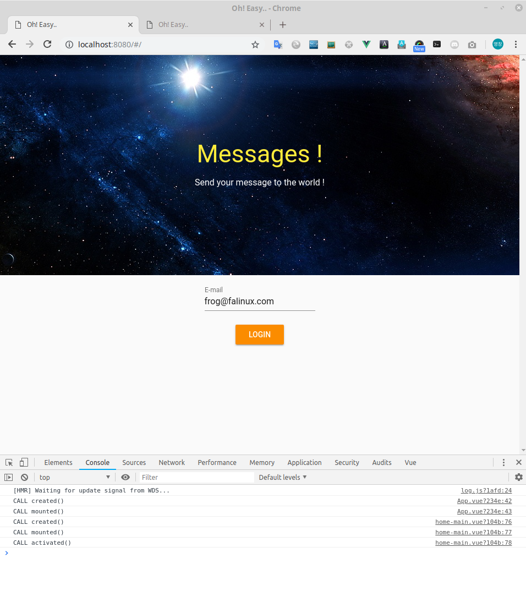
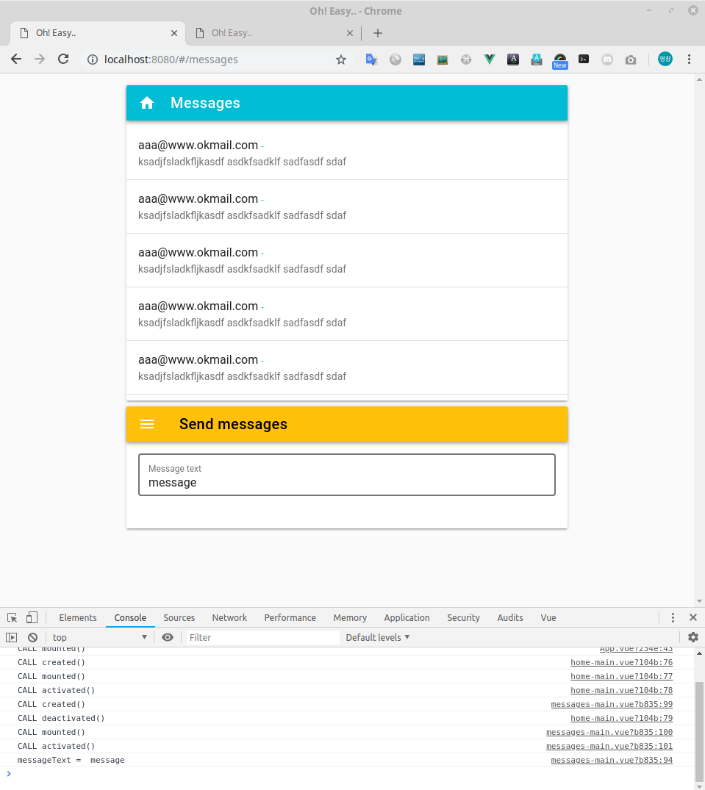

# 디자인 vuetify

Vue로 개발하려는 초보자들을 위한 가이드 문서입니다.  
이 장은 vuetify 를 이용해서 페이지를 디자인하는 과정을 설명합니다. 

> 유영창 : frog@falinux.com

## 페이지 이동

* [전체 목차](../README.md) 
* [이전 단계](./A005-라우팅.md)
* [다음 단계](./A000-준비중.md)

## 디자인 단계

초보자분들이 프런트앤드 개발을 할 때 단계적 개발을 하지 않아서 무지 막지한 고생을 하십니다. 

프런트앤드 개발 과정은 개발자 마다 다르겠지만 다음과 같은 순서를 지키시면 고생을 덜 하시고 생각보다 빠르게 개발 하실 수 있습니다. 

1. 웹 화면 구성 단계 - 전 여기서 이 단계를 디자인 단계라고 정의하겠습니다. 
2. 데이터 및 로직 구성 단계 - 전 여기서 이 단계를 데이터 단계라고 정의하겠습니다. 
3. API 연결 단계 - 전 여기서 이단계를 API 단계라고 정의하겠습니다. 

이 단계를 역으로 하는 방법도 하나의 방법입니다. 이 방법은 주로 백엔드 개발자들이 접근하시는 방법입니다.

최근에는 빠른 비즈니스 요구에 맞추어야 하고 사용자 측면에서 접근하는 개발 방법이 선호되고 있습니다. 

그래서 사용자가 사용하는 서비스 흐름을 위한 화면 기획과 함께 이를 시뮬레이션하는 디자인 구성을 끝낸 후 이후에 백엔드 단쪽으로 흘러 가는 개발 방법이 선호되고 있습니다. 

이왕이면 초보분들이 최근 흐름에 적응하도록 하기 위해서 이 따라하기 역시 디자인에서 백엔드 쪽으로 가는 방향으로 진행하고 있습니다. 

이제 이 디자인 단계를 따라해 보시면서 감을 잡아 보시죠..

### data 프로퍼티 정의와 `<template>`

디자인 단계에서는 가장 먼저 화면을 구성하고 화면 구성에 필요로 하는 data 필드 정의에 주력 합니다. 
vue 를 사용하는 방법으로 권장되는 것도 뷰 컴포넌트에는 화면 구성만 하고 비즈니스 로직이나 제어 로직은 가급적 배제 하는 것입니다. 

태스팅도 화면 구성이 제대로 되었는가에 테스팅의 중점을 둡니다. 

제 개인적인 개발 경험으로도 vue 확장자로 끝나는 싱글 컴포넌트를 만들때 ajax 나 기타 등등을 포함하면 디버깅도 어렵고 수시로 발생하게 되는 화면 수정에 어려움을 겪게 됩니다. 

인터넷 예제가 혼합한 형태를 알려 주는 것이 많아서, 이런 방법이 올바른 방법이라고 생각들 합니다.
제 생각은 다릅니다. 학습 예제로써 한번에 동작 방식을 설명하기 좋은 방법일 뿐입니다.

뷰 컴포넌트나 일반 컴포넌트는 그 소스가 간결하고 간단하고 UI 에 중점을 두는 것이 좋습니다. 

자 이런 생각으로 따라하기를 진행해 보겠습니다. 

디자인 단게에서는 어떻게 보여지는가 라는 점이 중요합니다.
실제 동작하듯이 보이는 가상 데이터를 vue 컴포넌트의 data 속성을 이용하여 처리 합니다. 
computed 같은 것 마저도 배제하고 오직 data 와 `<template>` 부분만 수정합니다. 

### vuetify 

전 개발자 입니다. 그래서 디자인 특히 색깔 감각은 꽝입니다. 
저 역시 멋진 홈페이지는 볼 줄 압니다. 제 눈 역시 생각보다 고급스럽습니다. 단지 손발이 그걸 못 따라가는 거죠

개발자가 디자인 한 것은 일반인이 금방 눈치 챕니다. 가끔 디자인 감각이 띄어난 개발자가 있으신데 그런 분들은 정말 정말 부럽습니다. 

주위 개발자나 기획자분들이 한숨 쉬며 울부짖는 것 중 하나가 감각있는 디자이너를 만나기 어렵다고 하소연 하는 것입니다. 
생각보다 디자이너라는 타이틀을 달고 있지만 디자인 툴을 잘 쓰는 분들이 더 많습니다. 

어찌되었든 그나마 디자이너가 계시면 좋죠.. 다른 일에 바빠서 이나마 없는 경우도 있습니다. 

그런데 다행인 점이 있습니다. 이런 고민을 우리만 한것이 아니고 전 세계의 개발자가 같이 고민한다는 점입니다. 
그리고 이런 고민을 해결할 방법을 구글님이 발표 하셨죠.. 예 매터리얼 디자인입니다. 앱 개발의 표준을 제안해 주신 겁니다. 

그래서 기능 중심의 앱에서 고민해야 할 디자인 문제를 엄청나게 해결 해 주셨습니다. 

거기다. Vuetify 라고 하는 자바스크립트 CSS 프레임 워크가 나왔습니다. 
디자인 감각이 없고 CSS 에 대한 전문가적 지식이 부족한 개발자가 매터리얼 디자인 컨셉을 해결 할 수 있도록 해 줍니다.

여러분은 여기를 꼭 기억해 두시기 바랍니다. 

> https://vuetifyjs.com/ko/getting-started/quick-start

따라가기를 진행하시다 보면 앞으로 자주 들어 가게 될 것입니다. 

vuetify 는 CSS 를 잘 모르더라도 구글 매터리얼 디자인 컨셉을 웹에서 잘 다룰 수 있도록 해 주는 프레임 워크 입니다 .

우리는 준비 과정에서 이미 이 패키지를 설치 했죠!

자 이 vuetify 를 이용하여 화면을 꾸며 보기 시작하겠습니다. 

**잠깐!**

초보자 여러분 vuetify 를 사용하시다 보면 모든 것을 vuetify 로 해결하시려고 하는데 프런트앤드 개발자라면 CSS 를 자유 자재로 사용하실 때까지 
공부를 계속 하시고 실무에 적용하도록 노력하셔야 합니다. 

복잡한 UI 를 만들어 가다보면 vuetify 만 가지고 안됩니다. 또한 vuetify 는 모바일에 좀 더 가깝습니다. 매터리얼 디자인 자체가 모바일을 위한 것이기 때문입니다. 
웹 화면을 만들때는 모바일과 다른 룰이 있음을 명심 하십시오..

### material 과 vuetify

vuetify 를 쓰려다 보면 여러가지 용어가 나와서 처음엔 힘듭니다. 사용되는 컴포넌트 이름들이 생소하거든요. 그런데 vuetify 를 쓰기전에 
매터리얼 디자인의 용어를 읽어 보고 나면 vuetify 의 용어들이 매터리얼 디자인 용어라는 사실을 알게 되고 대략 어떻게 사용해야 할지 감이 잡힙니다. 

여러분들에게 https://material.io 을 꼭 방문하셔서 영어로 되어 있지만 읽어 보시고 용어에 대한 감을 잡기 바랍니다. 
구글에 키워드 material design 을 사용하시면 꽤 읽을 만한 한글 자료도 많이 나옵니다. 

꼭! 용어에 먼저 익숙해 지시기를 바랍니다. 

### home-main.vue 수정 

이제 홈페이지 화면을 구현하는 home-main.vue 를 수정할 겁니다.

홒페이지는 다음과 같은 요소로 구성됩니다. 

* 배너 이미지와 캐치 프레이즈 텍스트 
* 로그인 이메일 주소 입력 창
* 로그인 버튼 

쉽죠?

이런 컴포넌트에서 데이터는 하나만 있으면 됩니다.,

* 이메일 데이터

사용자 동작은 버튼 클릭 하나만 있습니다. 

* 로그인 버튼 클릭 이벤트

이 요소를 구현하는 소스인 home-main.vue 는 다음과 같습니다.

> [src/home-main.vue]
~~~ javascript
<template>
  <v-container id="home-main" fluid class="ma-0 pa-0">
    <v-parallax
      dark
      height=400
      src="https://img-s2.onedio.com/id-56ddb4ad606fe1702c52c2b9/rev-0/raw/s-b980e3a17a58f7b7e1021f2df2ddf4c918ca0401.jpg"
    >
      <v-layout
        align-center
        column
        justify-center
      >
        <h1 class="display-2 mb-3 yellow--text">Messages !</h1>
        <h4 class="subheading">Send your message to the world !</h4>
      </v-layout>
    </v-parallax>
    <v-container>
      <v-layout
        align-center
        column
      >
        <v-text-field
          id="lbEmail"
          v-model="email"
          label="E-mail"
        ></v-text-field>

        <v-btn
          id="btnLogin"
          color="warning"
          @click="clickLogin"
        >Login</v-btn>

      </v-layout>
    </v-container>
  </v-container>
</template>

~~~

### messages-main.vue 수정 

다음에 구현해야 하는 것은 메세지들을 보내고 수신된 메세지를 보는 messages-main.vue 를 수정할 겁니다.

메세지 페이지는 다음과 같은 요소로 구성됩니다. 

* 홈으로 돌아갈 홈 아이콘 버튼 
* 메세지 리스트
* 보낼 메세지 텍스트 입력 

별로 없죠?

컴포넌트에서 데이터는 메세지 리스트와 보낼 메세지만 있으면 됩니다.

* 메세지 리스트 데이터
* 입력 메세지 택스트

사용자 동작은 홈 버튼 클릭 하나만 있습니다. 

* 홈 아이콘 버튼 클릭 이벤트

이 요소를 구현하는 소스인 messages-main.vue 는 다음과 같습니다.

> [src/messages-main.vue]
~~~ javascript
<template>
  <v-container id="messages-main" fluid fill-height>
      <v-layout
        align-center
        column
      >

        <v-card width=600>
          <v-toolbar color="cyan" dark>
            <v-icon @click="clickHome">home</v-icon>
            <v-toolbar-title>Messages</v-toolbar-title>
          </v-toolbar>

          <v-list two-line>
            <template v-for="(message, index) in messages">

              <v-list-tile :key="(index+'tl')" class="pt-0 pb-0">
                <v-list-tile-content>
                  <v-list-tile-title >{{message.email}} - {{message.date}}</v-list-tile-title>
                  <v-list-tile-sub-title >{{message.text}}</v-list-tile-sub-title>
                </v-list-tile-content>
              </v-list-tile>

              <v-divider :key="index"></v-divider>

            </template>
          </v-list>
        </v-card>

        <v-card width=600 class="mt-2">
          <v-toolbar color="amber" dark>
            <v-toolbar-side-icon></v-toolbar-side-icon>
            <v-toolbar-title class="black--text"> Send messages
            </v-toolbar-title>
          </v-toolbar>

          <v-text-field
            label="Message text"
            placeholder="please typing text"
            outline
            class="pa-3"
            v-model="messageText"
            @keypress="keypressMessageText"
          ></v-text-field>

        </v-card>

      </v-layout>
  </v-container>
</template>

~~~

### 따라하기 실행 화면 

자 이제 화면 디자인이 끝났습니다. 즐거운 마음으로 결과를 보시죠..

브라우저에서 각각 다음과 같이 URL 을 입력해 보세요

* http://localhost:8080/#/
* http://localhost:8080/#/messages

> http://localhost:8080/#/  
  

> http://localhost:8080/#/messages

### 항상 습관처럼 실행 하자!

이제 최종적으로 여러분이 따라하기에 문제가 없는지 다음 스크립트를 수행해서 확인합니다. 
이 과정은 조금 귀찮더라도 조기 퇴근을 위해서 꼭 습관화 하세요!

~~~
$ ./run-lint.sh
$ ./run-unit.sh
$ ./run-e2e.sh 
~~~

## 페이지 이동

* [전체 목차](../README.md) 
* [이전 단계](./A005-라우팅.md)
* [다음 단계](./A000-준비중.md)
