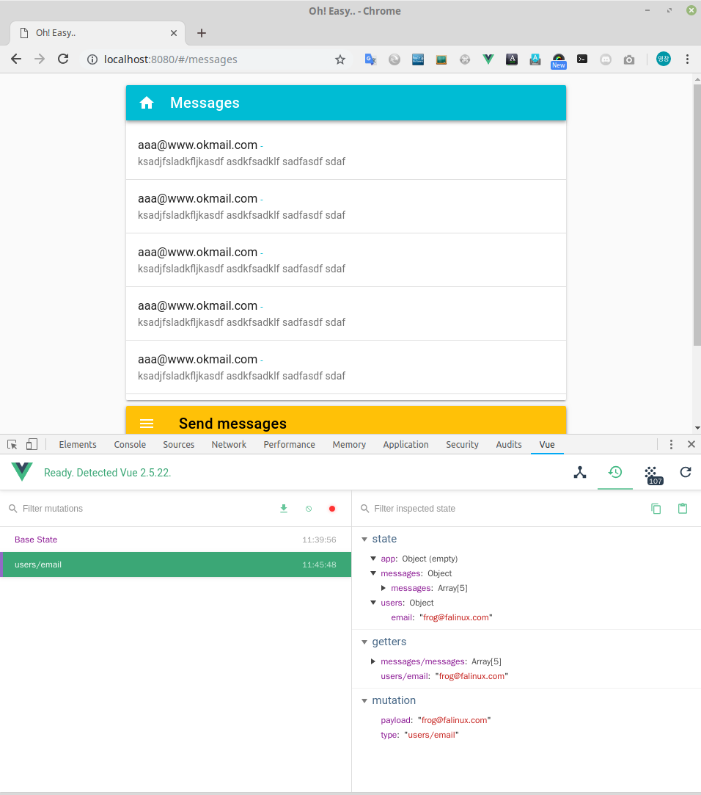

# 데이터 vuex

Vue로 개발하려는 초보자들을 위한 가이드 문서입니다.  
이 장은 vuex 를 이용해서 데이터 처리를 하는 과정을 설명합니다. 

> 유영창 : frog@falinux.com

## 페이지 이동

* [전체 목차](../README.md) 
* [이전 단계](./A006-디자인-vuetify.md)
* [다음 단계](./A008-테스트-e2e.md)

## 데이터 단계와 vuex

페이지 화면 디자인을 vuetify 를 통해서 구현해 보았습니다. 

디자인은 끝났으므로 이제 본격적인 데이터를 처리해야 합니다. 

페이지 화면을 만들어 가면서 vue 의 data 섹션을 이용하였다는 것을 기억나십니까?

home-main.vue 에서는 아래와 같은 부분이 데이터를 처리하고 있죠

~~~ javascript
export default {
    :
  data () {
    return {
      email: ''
    }
  },
~~~

여기서 잠깐!

vue 와 같이 태어나지 않았지만 추후에 필요에 의해서 만들어진  
vue 의 삼대 콤보 셋트인 vue, vue-router, vuex 를 꼭 기억하셔야 합니다. 

* vue : 화면 처리 , 사용자 입력 처리         
* vue-router : 기능 분리 
* vuex : 데이터 처리, API 서버 연동 

데이터 처리를 하려면 vuex 를 이용해야 합니다. 

### 데이터 처리 기준 

초보분들이 여기서 헷깔리는 부분이 있을 겁니다. 

뭐냐?

데이터 처리하는 것에 data, computed, vuex의 store, ... 뭐 이렇게 여러가지가 있습니다.
초보 입장에서 개념도 안 잡히는데 각각을 어떨때 쓰지? 하는 고민입니다. 

여기서 제가 명쾌한 가이드 라인을 잡아 드리겠습니다. 

1. 가급적 computed 필드에 정의하여 쓴다. 디자인 단계에서만 data 필드에서 정의하고 나중에 computed 필드로 옮겨 놓는다.
2. *.vue 확장자 소스 내에서만 사용 되고 다른 싱글 파일 컴포넌트(*.vue)에서 사용되지 않는다면 data 필드에 정의해도 된다. 
3. 여러 싱글 파일 컴포넌트(*.vue)에서 공유되어야 한다면 vuex 의 store 에 정의하여 쓴다. 
4. 서버에 데이터가 있다면 vuex 의 store 에 정의하여 쓴다. 

결론적으로 보면 같은 소스 안에서만 사용되지 않는다면 무조건 vuex 의 store 에서 관리하라는 이야기 입니다. 

### store 구조 변경 

데이터를 처리하기 전에 한가지 변경할 것이 있습니다. 

VUE CLI 3.0 에서 구조를 잡아준 결과로 src/store.js 가 달랑 하나 생겼습니다. 

초보분들이야 파일 하나에서 관리하면 되니 공부하실때는 편하지만 나중에 불편해 집니다. 

자 그래서 다음과 같은 구조로 뜯어 고칠 겁니다. 

~~~ PlainText
src/store/index.js
          modules/
                  index.js
                  app.js
                  users.js
                  messages.js
~~~

이중 다음 파일은 그냥 무조건 만드시고요!

* src/store/index.js
* src/store/modules/index.js

다음 파일은 각각 어플리케이션 전체 공통, 사용자 관리용, 메세지 관리용 이렇게 생각하시면 됩니다. 

* src/store/modules/app.js       : 어플리케이션 전체 공통
* src/store/modules/users.js     : 사용자 관리용
* src/store/modules/messages.js  : 메세지 관리용

뭐 내부에 내용은 간단하겠지만 초보라도 처음부터 이렇게 각각을 분류하여 작업하시는 것을 습관들이세요
다 피가 되고 살이 됩니다.

자 각각의 파일에 대한 설명 들어 갑니다. 

### store 모듈 포함 지원 - src/store/index.js 

src/store/index.js 파일은 크게 하는 것이 없습니다. 
vuex 프레임 워크를 이용하여 데이터 저장 구조인 store를 만들고 모듈들을 포함합니다.

> [src/store/index.js](https://github.com/kcert2018/start-vue-build-up-guide/blob/master/apps/z050-home-main-data/src/store/index.js)
~~~ javascript
import Vue from 'vue'
import Vuex from 'vuex'

import modules from './modules'

Vue.use(Vuex)

export default new Vuex.Store({
  modules,
  strict: process.env.NODE_ENV !== 'production'
  // strict: false
})
~~~

### store 모듈 구조 지원 - src/store/modules/index.js

src/store/modules/index.js 파일도 크게 하는 것이 없습니다. 
modules 디렉토리에 있는 *.js 파일을 모두 store 모듈로 등록해 버리는 겁니다. 

> [src/store/modules/index.js](https://github.com/kcert2018/start-vue-build-up-guide/blob/master/apps/z050-home-main-data/src/store/modules/index.js)
~~~ javascript
/**
 * The file enables `@/store/index.js` to import all vuex modules
 * in a one-shot manner. There should not be any reason to edit this file.
 */

const files = require.context('.', false, /\.js$/)
const modules = {}

files.keys().forEach(key => {
  if (key === './index.js') return
  modules[key.replace(/(\.\/|\.js)/g, '')] = files(key).default
})

export default modules
~~~

### 앱 전체 관리용 store 모듈 - src/store/modules/app.js

app.js 모듈은 앱 전체에 통용되는 데이터들을 정의하고 사용합니다. 

다음 같은 것들이 대상이 되겠죠..

* 인증 토큰
* 앱 톱 타이틀 네비게이터 제어 변수
* 앱 타이틀
* 등등...

따라하기에서는 그냥 기본형태만 정의해 놓기만 할 겁니다. 
새로운 모듈 만들때 복사해서 쓰면 편하죠 ^^;

> [src/store/modules/app.js](https://github.com/kcert2018/start-vue-build-up-guide/blob/master/apps/z050-home-main-data/src/store/modules/app.js)
~~~ javascript
const state = {
}

const getters = {
}

const mutations = {
}

const actions = {
}

export default {
  namespaced: true,
  state,
  getters,
  mutations,
  actions
}
~~~

### 사용자 관리용 store 모듈 - src/store/modules/users.js

따라하기 쉽게 하기 위해서 간단하게 정의한 로그인 사용자를 관리하는 모듈입니다. 

src/views/home-main.vue 에서 data 에 정의한 email 필드를 정의합니다. 
원래는 두단어 이상 조합하는게 좋은데 여기서는 그냥 email 만 쓰도록 하겠습니다.

> [src/store/modules/users.js](https://github.com/kcert2018/start-vue-build-up-guide/blob/master/apps/z050-home-main-data/src/store/modules/users.js)
~~~ javascript
const state = {
  email: ''
}

const getters = {
  email (_state) { return _state.email }
}

const mutations = {
  email (_state, payload) {
    _state.email = payload
  }
}

const actions = {
}

export default {
  namespaced: true,
  state,
  getters,
  mutations,
  actions
}
~~~

초보분들은 데이터 정의 할 때 반드시 state, getters, mutations 에 동일한 이름으로 만드는 버릇을 항상 들이세요
최적화는 죽기 직전에 해도 늦지 않습니다. 

### 메세지 관리용 store 모듈 - src/store/modules/messages.js

이제 메세지들을 관리하는 모듈을 만들어 보죠

src/views/messages-main.vue 의 data 에 정의한 messages 필드를 정의합니다. 

> [src/store/modules/messages.js](https://github.com/kcert2018/start-vue-build-up-guide/blob/master/apps/z050-home-main-data/src/store/modules/messages.js)
~~~ javascript
const state = {
  messages: [
    { email: 'aaa@www.okmail.com', time: '23:37:00', text: 'ksadjfsladkfljkasdf asdkfsadklf sadfasdf sdaf' },
    { email: 'aaa@www.okmail.com', time: '23:37:00', text: 'ksadjfsladkfljkasdf asdkfsadklf sadfasdf sdaf' },
    { email: 'aaa@www.okmail.com', time: '23:37:00', text: 'ksadjfsladkfljkasdf asdkfsadklf sadfasdf sdaf' },
    { email: 'aaa@www.okmail.com', time: '23:37:00', text: 'ksadjfsladkfljkasdf asdkfsadklf sadfasdf sdaf' },
    { email: 'aaa@www.okmail.com', time: '23:37:00', text: 'ksadjfsladkfljkasdf asdkfsadklf sadfasdf sdaf' }
  ]
}

const getters = {
  messages (_state) { return _state.messages }
}

const mutations = {
  messages (_state, payload) {
    _state.messages = payload
  }
}

const actions = {
}

export default {
  namespaced: true,
  state,
  getters,
  mutations,
  actions
}
~~~                 

메세지 모듈도 보면 그냥 data 를 옮겨 왔다는 것을 알 수 있습니다. 

이렇게 디자인 단계에서 정의한 data 를 그냥 vuex 의 store 모듈로 옮기는 과정을 거치시면 됩니다.

## 뷰의 data 필드를 store 의 변수로 대치하기

뷰 data 필드의 데이터와 동일한 필드를 store 에 정의 한 후 뷰에 연결합니다. 

### messages-main.vue 와 store 연결

먼저 messages-main.vue 부터 연결합니다. data 필드부분을 삭제하고 , computed 를 다음과 같이 바꿉니다. 

mapGetters 를 이용하여 이 작업을 처리 할 수 있습니다. 

제가 이 부분부터 하는 이유는 소스를 보시면 알겠지만 단순히 데이터의 읽기만 있기 때문입니다. 
데이터의 쓰기가 발생할 때는 computed 정의 부분이 조금 복잡해 집니다. 쉬운것 부터 하죠...

> [src/views/messages-main.vue 수정 전]()

~~~ javascript
  data () {
    return {
      messages: [
        { email: 'aaa@www.okmail.com', time: '23:37:00', text: 'ksadjfsladkfljkasdf asdkfsadklf sadfasdf sdaf' },
        { email: 'aaa@www.okmail.com', time: '23:37:00', text: 'ksadjfsladkfljkasdf asdkfsadklf sadfasdf sdaf' },
        { email: 'aaa@www.okmail.com', time: '23:37:00', text: 'ksadjfsladkfljkasdf asdkfsadklf sadfasdf sdaf' },
        { email: 'aaa@www.okmail.com', time: '23:37:00', text: 'ksadjfsladkfljkasdf asdkfsadklf sadfasdf sdaf' },
        { email: 'aaa@www.okmail.com', time: '23:37:00', text: 'ksadjfsladkfljkasdf asdkfsadklf sadfasdf sdaf' }
      ],
      messageText: ''
    }
  },

  computed: {
    ...mapGetters({
    }),
~~~

> [src/views/messages-main.vue 수정 후](https://github.com/kcert2018/start-vue-build-up-guide/blob/master/apps/z050-home-main-data/src/views/messages-main.vue)

~~~ javascript
  data () {
    return {
      messageText: ''
    }
  },

  computed: {
    ...mapGetters({
      messages: 'messages/messages'
    }),
~~~

data 에 선언된 messages 를 computed 의 mapGetters 를 이용하여 store 에서 참조 하도록 변경했습니다. 

messages: 'messages/messages' 를 선언할 때 

"messages:" 에 사용되는 명칭은 뷰에서 사용할 변수 이름입니다. 
'messages/messages' 은 messages store 모듈에 선언된 messages 의 getters 를 의미합니다. 

같은 이름을 사용해서 초보분들이 헷깔리게 된 거지만 다음과 같은 형식이라고 생각하시면 됩니다.

    뷰에서사용할이름: 'store모듈이름/모듈에선언된getters이름"

data 에 messageText 는 뷰 안에서만 사용할 것이기 때문에 computed로 옮기지 않고 있습니다.

### home-main.vue 와 store 연결

home-main.vue 부터 연결합니다. email 은 data 필드에 그대로 둡니다. 이 email 은 사용자 입력값을 보존하는 목적이기 때문입니다. 

대신 로그인 버튼이 클릭되면 이 email 필드 값을 store 에 저장해야 합니다. 메세지 를 전달할때 누가 보냈는지 사용해야 하기 때문입니다. 
이때 mapMutations 을 사용합니다. 

다음과 같이 바꿉니다. 

> [src/views/home-main.vue 수정 전]()
~~~ javascript
 methods: {
    ...mapMutations({
    }),
    ...mapActions({
    }),
    clickLogin () {
      if (this.email) {
        this.$router.push({ name: 'messages-main' })
      }
    }
  },
~~~

> [src/views/home-main.vue 수정 후](https://github.com/kcert2018/start-vue-build-up-guide/blob/master/apps/z050-home-main-data/src/views/home-main.vue)
~~~ javascript
 methods: {
    ...mapMutations({
      loginEmail: 'users/email'
    }),
    ...mapActions({
    }),
    clickLogin () {
      if (this.email) {
        this.loginEmail(this.email)
        this.$router.push({ name: 'messages-main' })
      }
    }
  },
~~~

clickLogin() 함수에서 메세지 뷰로 이동하기 전에 로그인 이메일을 this.loginEmail 로 정의한 users/email 뮤테이션을 호출하는 것을 볼 수 있습니다.

여기까지 수정하신 후 다음을 호출하여 문제가 없는지 검사해 봅니다. 

~~~
$ ./run-lint.sh
$ ./run-unit.sh
$ ./run-e2e.sh 
~~~

[vue 플러그인](https://chrome.google.com/webstore/detail/vuejs-devtools/nhdogjmejiglipccpnnnanhbledajbpd) 을 크롬에 설치했다면, 
브라우저에서 사용자 이메일을 입력 한 후 로그인을 수행하고 나면 다음과 같이 store 내부 상황을 보실 수 있습니다. 

## 메세지 입력 처리 

이제 본격적인 메세지 연동 앱 다운 모습을 만들어 보도록 하겠습니다. 

아직은 서버와 연결된 상태가 되지 않았기 때문에 다른 사람의 메세지는 못 보겠지만 본인이 넣은 메세지가 보여 지도록 해 보겠습니다. 

messages-main.vue 에서 메세지 입력 창에 메세지를 넣고 엔터를 치면 keypressMessageText() 를 호출하게 됩니다. 

이 함수에서 messages 모듈의 messages에 메세지를 넣어야 합니다.

### 뮤테이션 ? 액션 ?

초보분들! store 에서 뮤테이션 과 액션 두가지 처리 함수가 있어 어떤 것을 사용해야 할지 고민스럽죠?

예 고민 하지 마십시오.. 어려운 말로 뮤테이션은 동기 함수이고 액션은 비동기 함수입니다. 

그러면 쉬운 말은?

그냥 서버와 연관된 처리를 해야 할 경우나 사용자 입력과 연관되면 액션 , 단순 변수 값 설정만 하면 뮤테이션 
이렇게 생각하세요.

메세지를 넣는 것은 사용자가 엔터를 쳤죠? 그리고 아마도 나중에는 서버에 보낼 겁니다. 
당근 액션으로 처리 해야 합니다. 

### dateformat 추가 

VUE 로 개발해 가면서 필요한 여러가지가 있지만 시간 포맷팅 함수는 정말 정말 필수적입니다. 

전 dateformat 노드 모듈을 즐겨 사용합니다. 

다음과 같이 추가해 봅시다. 

~~~
$ ./run-bash.sh
$ cd home-main
$ yarn add -D dateformat
~~~

dateformat 는 다음과 같이 사용 할 수 있습니다.

~~~ javascript
import dateFormat from 'dateformat'

let now = new Date()
dateFormat(now, "dddd, mmmm dS, yyyy, h:MM:ss TT");
~~~

### 메세지 전송 액션 함수 sendMessage()

자 이름을 뭘로 지을까요? sendMessage 가 직관적이죠?
이 이름으로 sendMessage 을 다음과 같이 선언해 봅시다. 

> [src/store/modules/messages.js](https://github.com/kcert2018/start-vue-build-up-guide/blob/master/apps/z050-home-main-data/src/store/modules/messages.js)
~~~ javascript
const actions = {
  sendMessage (context, payload) {
    let email = payload.email
    let text = payload.text
    let message = { email, text, time: dateFormat(Date.now(),"hh:MM:ss") }
    context.commit('addMessage', message)
  }
}
~~~

액션 sendMessage() 함수는 payload 에 다음과 같은 객체를 받게 됩니다.

~~~ javascript 
   { email: 'frog@falinux.com', text: 'this is text'}
~~~

이걸 객체 정보를 바탕으로 새로운 메세지로 다음과 같이 만들어서 addMessage() 뮤테이션을 이용하여 
messages 배열에 추가 합니다. 

~~~ javascript 
    let message = { email, text, time: dateFormat(Date.now(),"hh:MM:ss") }
    context.commit('addMessage', message)
~~~

addMessage() 은 다음과 같이 만듭니다. 

> [src/store/modules/messages.js](https://github.com/kcert2018/start-vue-build-up-guide/blob/master/apps/z050-home-main-data/src/store/modules/messages.js)
~~~ javascript
const mutations = {
    :
  addMessage(_state, payload) {
    let message = payload
    let newArray = _state.messages.slice()
    newArray.shift()
    newArray.push(message)
    _state.messages = newArray
  },
}
~~~

초보분들이 여기서 주의해서 볼 것이 입니다.
기존에 선언된 state.messages 를 가져와서 새로운 배열 슬라이스를 만든 후에,
처음 것을 삭제하고 새로운 메세지를 추가한 다음 새로운 배열을 다시 state.messages 에 대입하는 것입니다. 

배열은 VUE 에서 변화를 감지 하려면 이렇게 새로운 배열을 만들어 지정해야 합니다. 

그래야 messages-main.vue 에 선언되어 사용되는 messages 가 store 의 messages 와 연동되어 
변화가 있을 때마다 렌더링 됩니다. 

~~~ javascript 
computed: {
    ...mapGetters({
      messages: 'messages/messages',
~~~

이제 사용자가 메세지 입력이 되면 store 에 저장하도록 수정해야 합니다. 

다음과 같이 mapActions 에 sendMessage를 선언하고 keypressMessageText() 에서 this.sendMessage() 를 호출합니다.

여러분은 keypressMessageText() 함수에 async 키워드를 사용하고 this.sendMessage() 함수에 await 키워드를 사용하고 있는 것을 볼 수 있습니다. 
액션이 비동기 함수이고 순차적 처리를 위해서 이런식으로 처리해 주어야 합니다.

이렇게 한 후 메인 홈 페이지 로긴 한 후 메세지 뷰로 이동 한 후 메세지를 입력하여 엔터를 누르면 메세지 리스트가 변하게 됩니다. 

> [src/views/messages-main.vue](https://github.com/kcert2018/start-vue-build-up-guide/blob/master/apps/z050-home-main-data/src/views/messages-main.vue)
~~~ javascript
methods: {
      :
    ...mapActions({
      sendMessage: 'messages/sendMessage'
    }),
      :
    async keypressMessageText (e) {
      if (e.key === 'Enter') {
        console.log('messageText = ', this.messageText)
        await this.sendMessage({ email: this.loginEmail, text: this.messageText })
      }
    }
~~~ 

쉽죠?

vuex 에 대한 데이터 처리는 여기까지 입니다. 

### 정리 하면 ...

디자인 단계에서는 data 필드에 디자인에 필요한 데이터 필드를 선언해서 사용했다면

데이터 단계에서는 이렇게 정의된 데이터를 store 에 모듈로 분류하고 사용자 입력에 발생한 것을 액션애 연동합니다.

### 항상 습관처럼 실행 하자!

이제 최종적으로 여러분이 따라하기에 문제가 없는지 다음 스크립트를 수행해서 확인합니다. 
이 과정은 조금 귀찮더라도 조기 퇴근을 위해서 꼭 습관화 하세요!

~~~
$ ./run-lint.sh
$ ./run-unit.sh
$ ./run-e2e.sh 
~~~

## 페이지 이동

* [전체 목차](../README.md) 
* [이전 단계](./A006-디자인-vuetify.md)
* [다음 단계](./A008-테스트-e2e.md)
